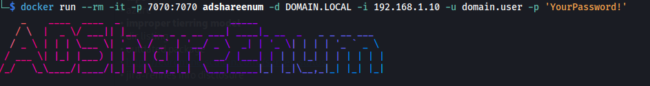
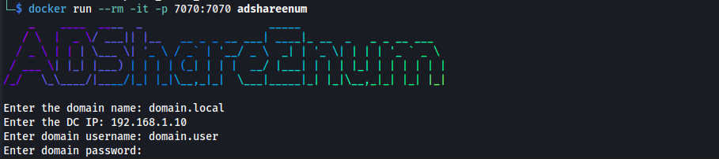
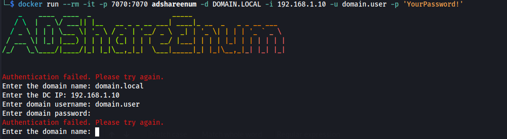

# 🛠️ ADShareEnum 

**ADShareEnum** is a lightweight Bash-based Active Directory (AD) enumeration tool that identifies domain-connected hosts and scans their SMB shares for `READ` and `WRITE` access. It uses Docker to ensure a portable, reproducible environment, and leverages tools like **Impacket**, **NetExec**, and **Kerberos** authentication.

---

## Features

- Kerberos and password-based domain authentication
- Enumerates all AD-connected computers
- Scans SMB shares for `READ` and `WRITE` permissions
- Filters out default/system shares (`IPC$`, `NETLOGON`, etc.)
- Generates a clean, organized report
- Serves the report via HTTP (port `7070`)

---

## Installation

Ensure you have [Docker](https://www.docker.com/) installed.

```bash
# Clone this repository
git clone https://github.com/lucsemassa/adshareenum.git
cd adshareenum

# Build the Docker image
sudo docker build -t adshareenum .
```

## Running the Tool
### Option 1: Run with parameters
```bash
docker run --rm -it -p 7070:7070 adshareenum -d DOMAIN.LOCAL -i 192.168.1.10 -u domain.user -p 'YourPassword!'
```



## Option 2: Interactive prompt

If you don't pass any arguments, the tool will prompt you interactively.
```bash
docker run --rm -it -p 7070:7070 adshareenum
```


If the credentials provided are not correct, `adshareenum` will ask again until the set is correct:



## Supported parameters

| Flag | Description                      |
|------|----------------------------------|
| `-d` | Domain name (e.g. corp.local)    |
| `-i` | Domain Controller IP             |
| `-u` | Username                         |
| `-p` | Password                         |
| `-h` | Show help message                |

## Output

After successful execution, the tool generates the following:

- A file named `share_scan_result_<username>.txt` located in the `/output` directory inside the container.
- This file contains a list of **readable** and **writable** SMB shares across discovered computers, excluding default shares like `IPC$`, `NETLOGON`, `SYSVOL`, and `print$`.
- The results are also served via a local HTTP server at:  
  `http://localhost:7070/share_scan_result_<username>.txt`


## Notes

- This tool requires **valid domain credentials** to authenticate and enumerate resources.
- If Kerberos tickets can be retrieved, Kerberos authentication will be preferred. Otherwise, the tool falls back to password-based authentication.
- The tool uses `Impacket` and `NetExec` under the hood for Active Directory enumeration and SMB share discovery.
- The enumeration is split into chunks for better handling of large environments.
- A small HTTP server is launched at the end for easy file retrieval via browser.

> 🔐 Be cautious when using credentials. Prefer test environments or environments where you have proper authorization.
